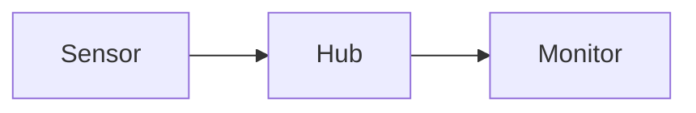

# Math and diagrams

[Documentation](README.md)

Markdown Preview can display equations and Mermaid diagrams offline. **Code** and **Edit** keep your original source.

## Equations

Write inline math as `$x^2+y^2=1$` or `\(x^2+y^2=1\)`. For a display equation, put `$$` delimiters on their own lines:

```text
$$
\mathbf{p}_A = \mathbf{R}_{AB}\mathbf{p}_B + \mathbf{t}_{AB}
$$
```

The equivalent `\[ ... \]` display form also works. Display equations must occupy their own block, without blank lines inside.

Dollar math is deliberately conservative: a single-line expression must begin with a non-digit, non-space character, end without a space, and not touch surrounding letters or numbers. Use `\(2x+1\)` for expressions beginning with a number. Prices such as `$5` and escaped dollars stay text. Math inside code stays code.

Choose **Copy TeX** beside an equation to copy its source without the delimiters. Invalid or unsupported equations show their source and a local explanation. Built-in KaTeX notation is supported; custom macro definitions, external resources and HTML commands are disabled. Equation numbering is not available yet.

## Diagrams

Use a `mermaid` code fence:

````text

````

Flowcharts, sequence diagrams and `stateDiagram-v2` diagrams are supported. Choose **Enlarge** to explore a diagram, **Copy source** to reuse its text, or expand its text alternative. A syntax error affects only that diagram.

Diagrams use the app's theme. Embedded HTML, links, callbacks and custom styles are disabled. Interactive HTML documents are not supported by this feature.

## Reading limits

Preview renders up to 128 equations and 16 diagrams per document. Each equation can contain up to 4,096 characters; each diagram up to 8,192 characters, 80 lines, 48 nodes and 80 edges or messages. Additional complexity limits keep reading responsive. When a limit is reached, source remains available.

Source files remain portable, but other readers need their own math or Mermaid support. The [offline reading export](packages-and-export.md) includes rendered math with local fonts and a labelled source fallback for diagrams; it does not render Mermaid diagrams.
